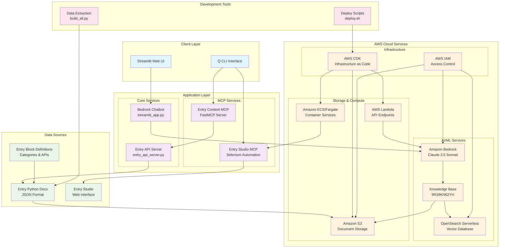
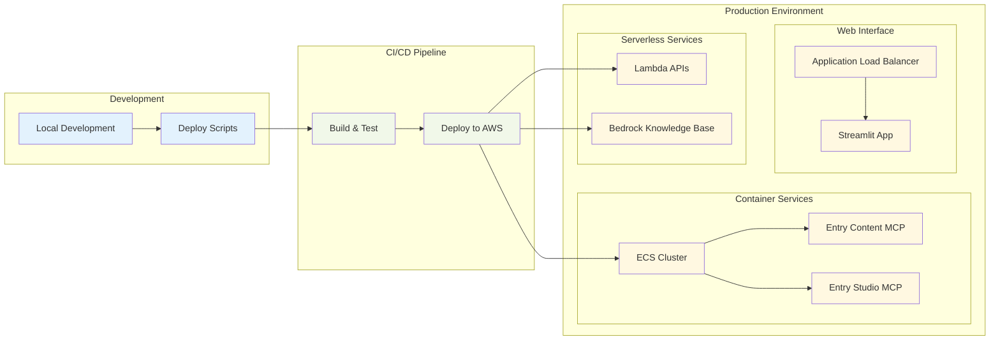
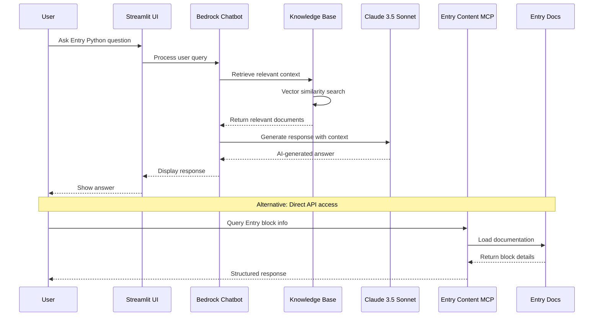

# Entry Python RAG System Architecture

## System Overview Diagram

## Component Details

### MCP Services
- **Entry Content MCP**: FastMCP server providing Entry documentation APIs
- **Entry Studio MCP**: Selenium-based automation for Entry Studio web interface

### Core Services  
- **Bedrock Chatbot**: Streamlit-based chat interface using Claude 3.5 Sonnet
- **Entry API Server**: FastMCP server exposing Entry block and category information

### AWS Services
- **Amazon Bedrock**: Foundation model service with Claude 3.5 Sonnet
- **Knowledge Base**: RAG system with ID 9R38KN62YH
- **OpenSearch Serverless**: Vector database for document embeddings
- **S3**: Storage for Entry documentation and media files
- **Lambda**: Serverless API endpoints
- **ECS/Fargate**: Container orchestration for MCP services

### Data Pipeline
- **Extraction**: Automated data extraction from Entry documentation
- **Processing**: Document parsing and embedding generation
- **Storage**: Vector storage in OpenSearch with metadata
- **Retrieval**: Semantic search and context generation

## Deployment Architecture

## Data Flow Diagram

