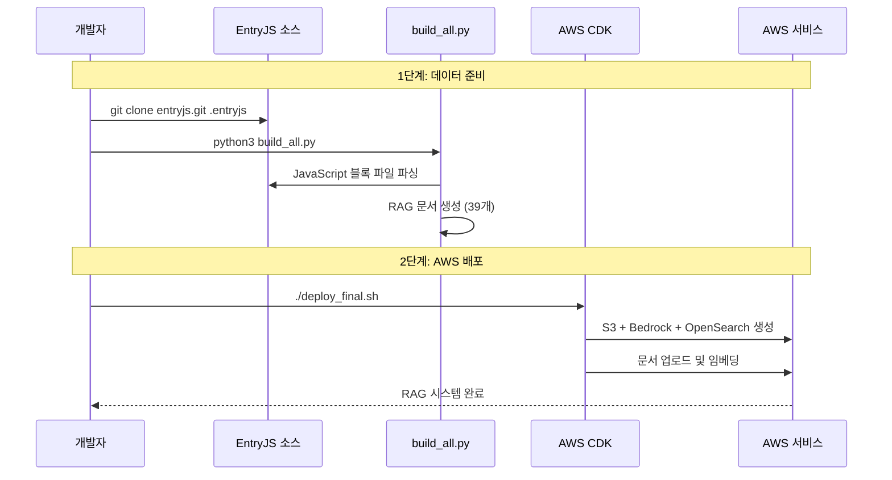
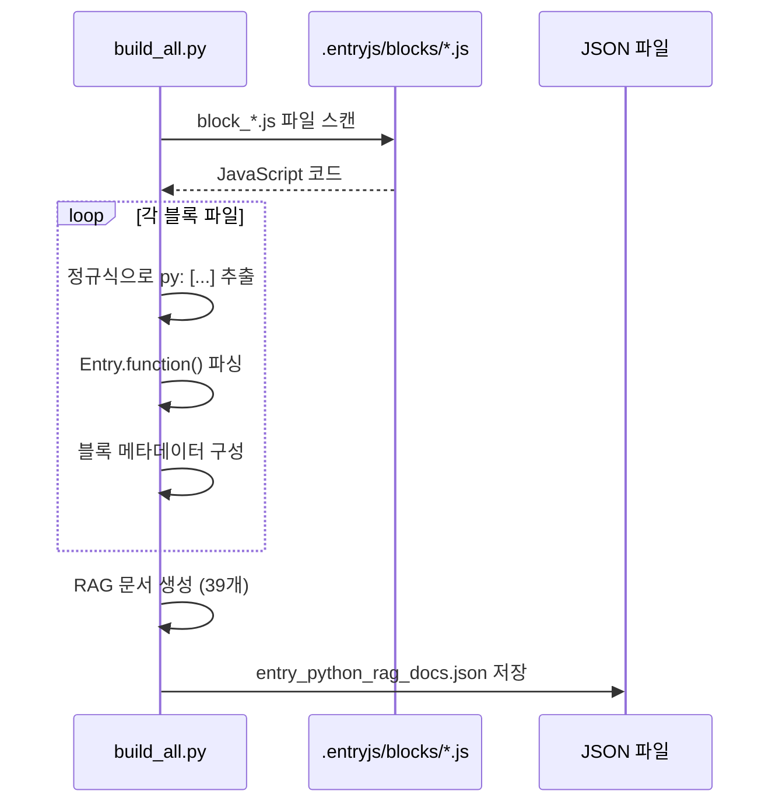
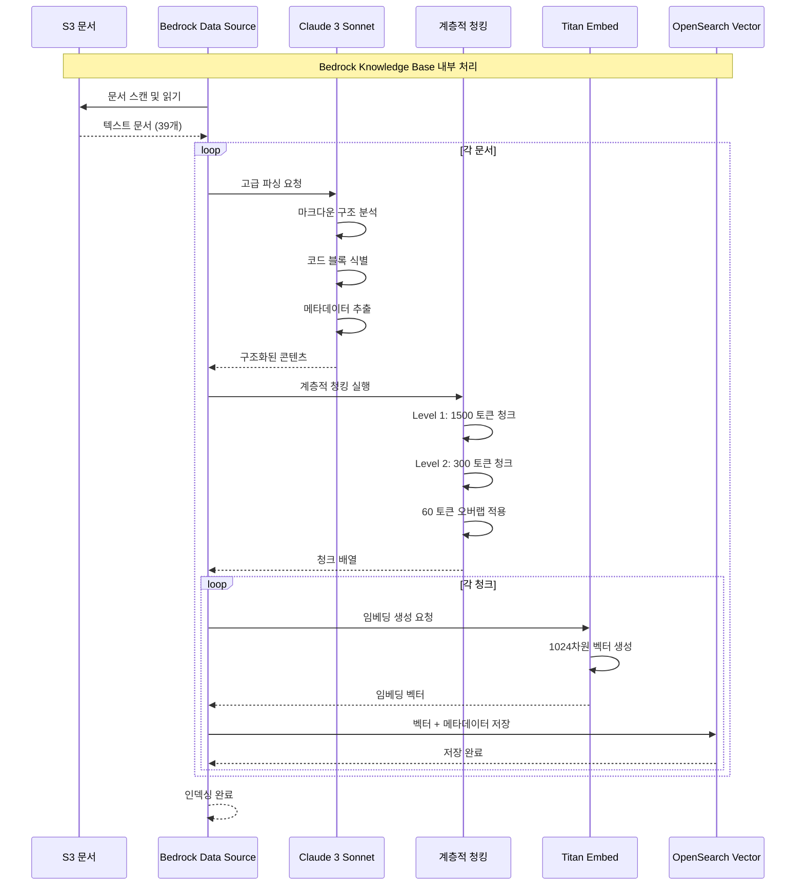
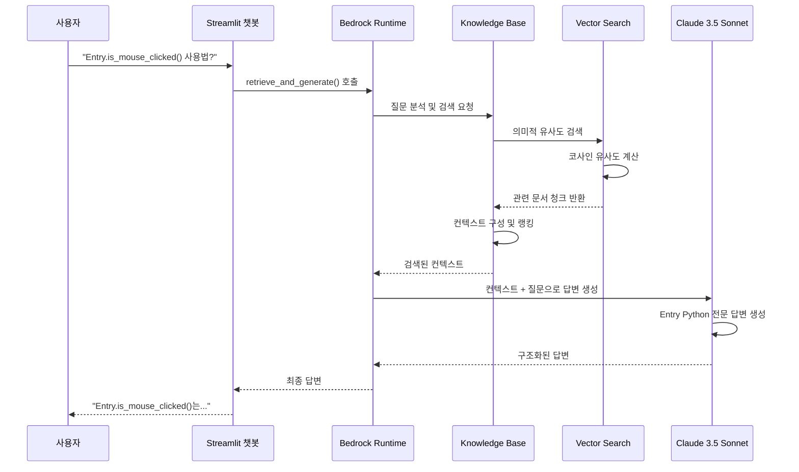

# Entry Python RAG 임베딩 시퀀스 다이어그램

## 전체 임베딩 프로세스 시퀀스

## 데이터 추출 상세 시퀀스

## AWS Bedrock 임베딩 내부 프로세스

## RAG 검색 시퀀스

## 핵심 특징

### 1. 외부 의존성 관리
- EntryJS 오픈소스 저장소를 `.entryjs`에 클론
- 상대경로 `../../.entryjs`로 접근
- JavaScript 파일에서 Python 문법 추출

### 2. 정규식 기반 파싱
- `py: [...]` 패턴으로 Python 문법 블록 식별
- `'Entry.function()'` 형태의 함수 추출
- 파일명에서 카테고리 자동 추출

### 3. 계층적 문서 구조
- 카테고리별 가이드 문서 (14개)
- 개별 블록 참조 문서 (23개)
- 일반 가이드 및 FAQ (2개)

### 4. AWS 완전 관리형 RAG
- Bedrock Knowledge Base로 임베딩 자동화
- Claude 3 Sonnet 기반 고급 파싱
- OpenSearch Serverless 벡터 저장
- 통합 검색+생성 API 제공
